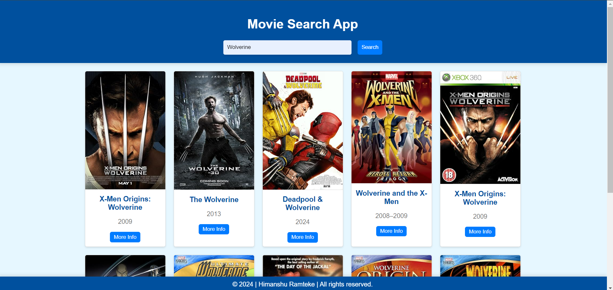

# Movie Search App [Day-25 Challenge {Chai☕︎ aur Code</>}]

This is a simple movie search app built with HTML, CSS, and JavaScript. It allows users to search for movies using the OMDB API and displays movie information including the title, poster, release year, and additional details such as plot, director, and actors.

## Features🚀

- Search for movies by title.
- Display movie posters, titles, and release years.
- View detailed information about each movie.
- Responsive design with a blue-themed color scheme.
- Interactive UI with animations and modal pop-ups.
