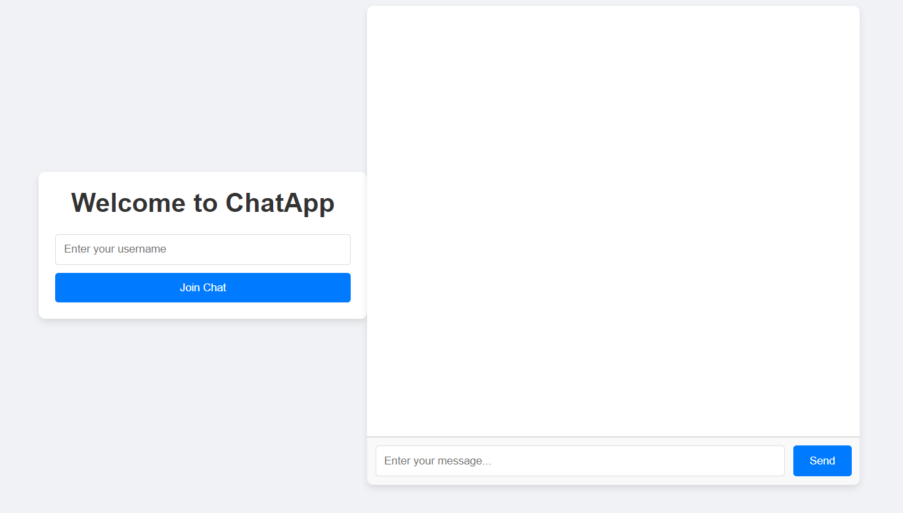
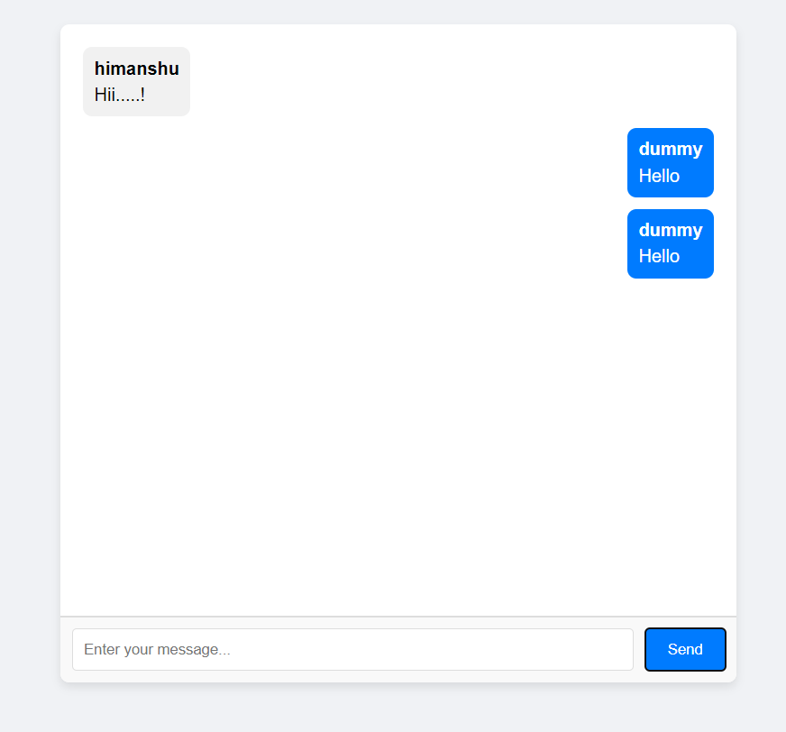

# Chat Application

A real-time chat application built using HTML, CSS, JavaScript, Node.js, and WebSocket.

## Features

- User authentication: Users can enter a username before joining the chat.
- Real-time messaging: Users can send and receive messages instantly.
- Message differentiation: Messages from different users are styled differently.
- Responsive design: The application is responsive and works well on various screen sizes.
- Smooth animations: The chat interface includes smooth animations for better user experience.
