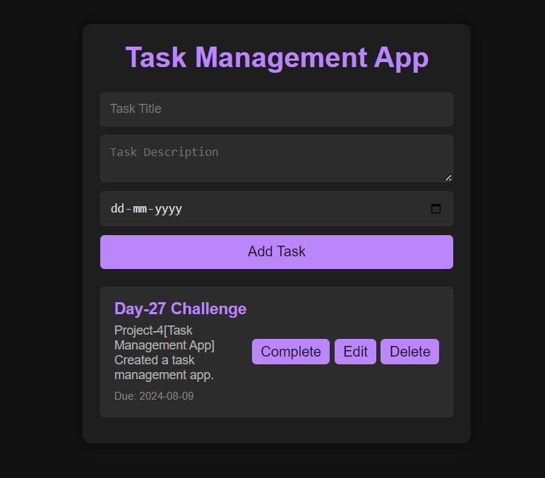

# Task Management App [Day-27 Challenge {Chai aur Code}]☕

A simple, responsive task management app built using HTML, CSS, and JavaScript. The app allows users to add, edit, delete, and manage tasks with a modern dark mode user interface.

## Features🚀

- Add Tasks: Users can add new tasks with a title, description, and due date.
- Edit Tasks: Users can edit existing tasks by clicking the "Edit" button.
- Delete Tasks: Users can delete tasks with a confirmation dialog to prevent accidental deletions.
- Dark Mode: The app features a visually appealing dark mode for a modern user experience.

## Technologies Used☕

- HTML5: For the basic structure of the app.
- CSS3: For styling the user interface, including a dark mode theme.
- JavaScript (ES6): For adding interactivity and managing tasks.