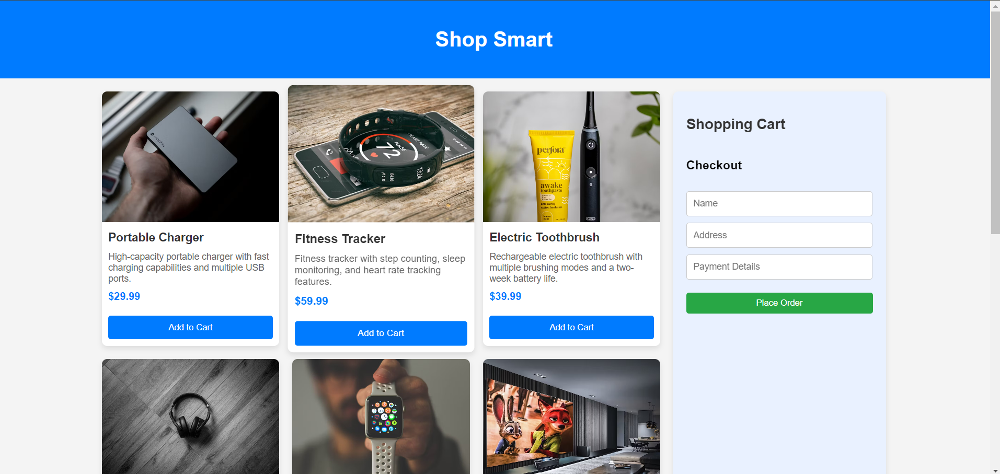
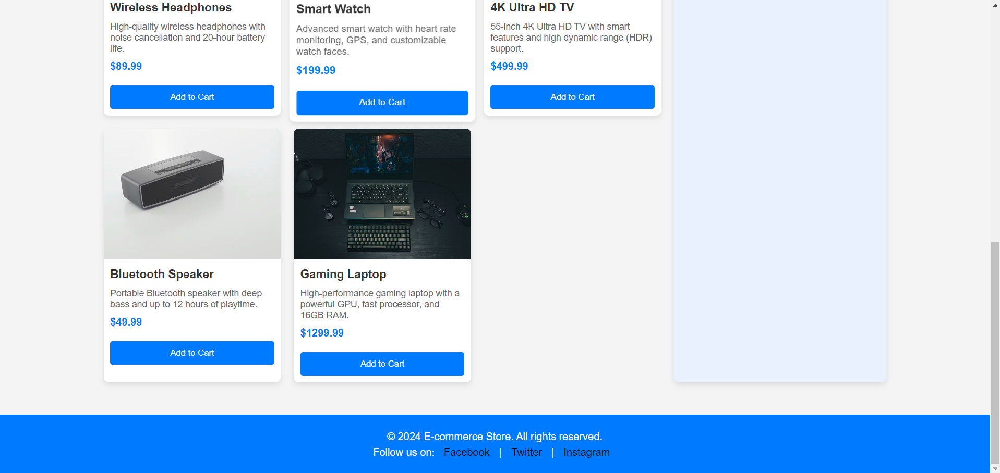

# E-commerce Website [Day-28 Challenge {Chai aur Code}]☕

This is a basic e-commerce website project that allows users to browse products, add items to a shopping cart, and proceed to checkout.

## Features🚀

- **Product Listing**: Products are dynamically generated from a JSON array and displayed as cards on the homepage.
- **Shopping Cart**: Users can add products to the shopping cart, update quantities, and remove items.
- **Checkout**: Users can fill out a checkout form and submit their order. A confirmation message is displayed with order details.
- **Responsive Design**: The website is styled to be responsive and user-friendly on various devices.

## Technologies Used☕

- HTML5: For the basic structure of the app.
- CSS3: For styling the user interface.
- JavaScript (ES6): For adding interactivity and managing tasks.