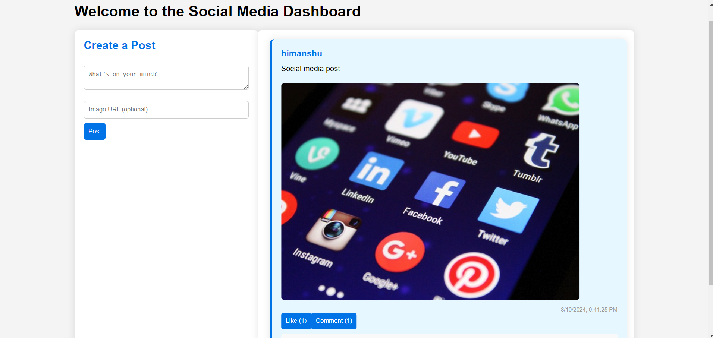

# Social Media Dashboard [Day-29 Challenge {Chai aur Code}]☕

This project is a simple social media dashboard that allows users to log in, create posts, and interact with posts by liking and commenting. The dashboard features a clean, responsive user interface with distinct styles for posts created by different users.

## Features🚀

- **User Authentication**: A login form that collects a username and password. User data is stored in localStorage or sessionStorage.
- **Create Posts**: Users can create new posts with text and optional images.
- **Display Posts**: Posts are displayed in a feed, showing details like text, image, username, and timestamp.
- **Post Interactions**: Users can like posts and add comments. The number of likes and comments is dynamically updated.

## Technologies Used☕

- HTML5: For the basic structure of the app.
- CSS3: For styling the user interface.
- JavaScript (ES6): For adding interactivity and managing tasks.